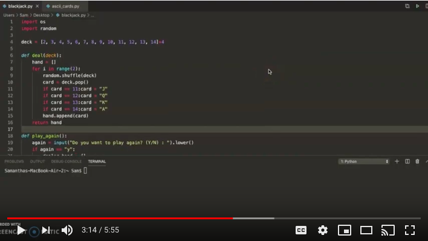

## Python Hackathon

For our hackathon project, my partner and I chose to create a blackjack game in python. We utilized the "Use, Modify, Create" methodology with code found on [GitHub](https://gist.github.com/mjhea0/5680216).

```python
def game():
#clear the "choice" variable and clear the screen
	choice = 0
	clear()
	print ("WELCOME TO BLACKJACK!\n")
#dealer_hand and player_hand are list variables populated by the "deal" function
    dealer_hand = deal(deck)
	player_hand = deal(deck)
#check to see if either player has blackjack
	blackjack(dealer_hand, player_hand)
#Player hand
	while total(player_hand) < 21:
		print ("The dealer is showing a " + str(dealer_hand[0]))
		print ("You have a " + str(player_hand) + " for a total of " + str(total(player_hand)))
#Hit or stand?
        choice = input("Do you want to [H]it or [S]tand: ").lower()
		if choice == 'h':
			hit(player_hand)
			clear()
		elif choice == "s":
			break
#dealers hand
    while total(dealer_hand) < 17:
		hit(dealer_hand)
#score evaluates the hand results
	score(dealer_hand, player_hand)
	play_again()
```

[!](https://youtu.be/ddibLfuTo10)

<h3 align="center">
  <a href="https://samcabano.github.io/cabano-profile/">Return to ABOUT ME</a>
</h3>
